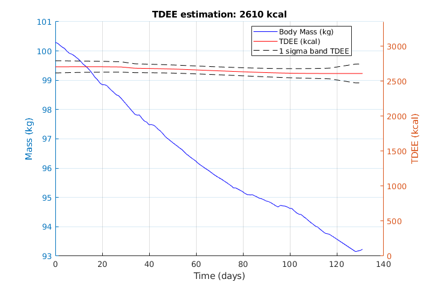
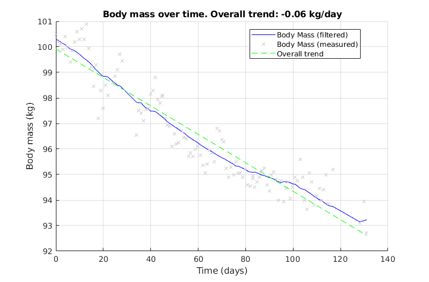
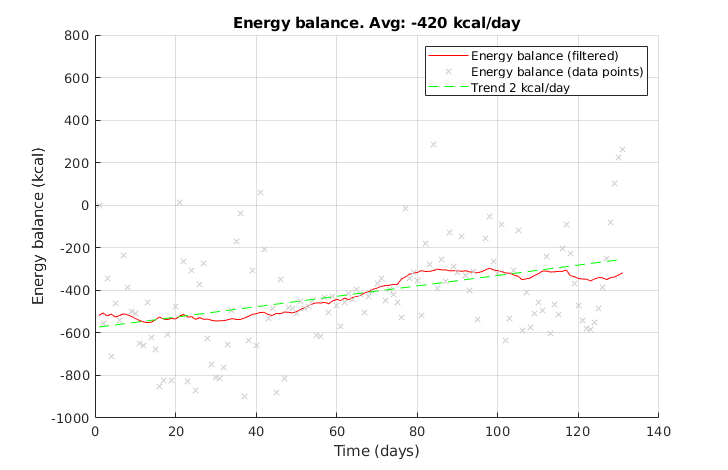
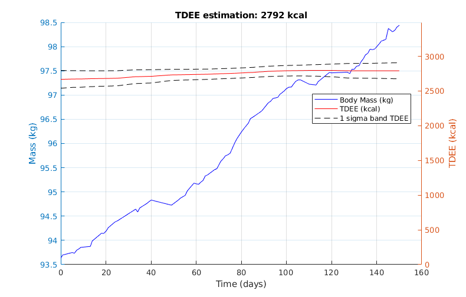
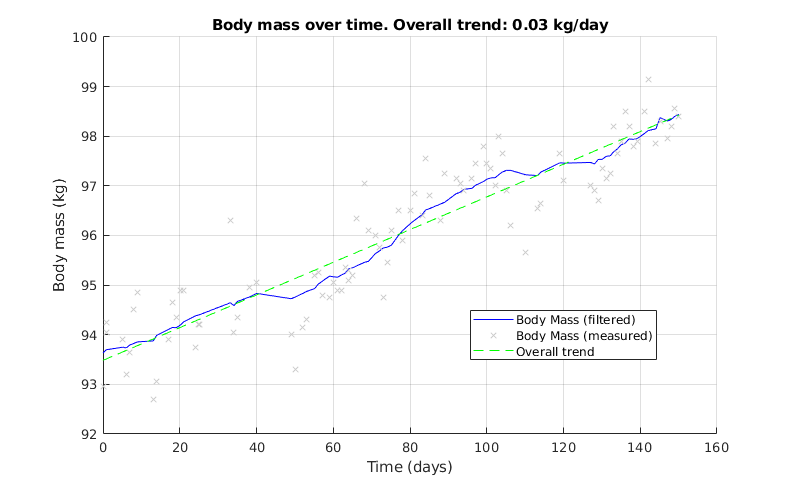
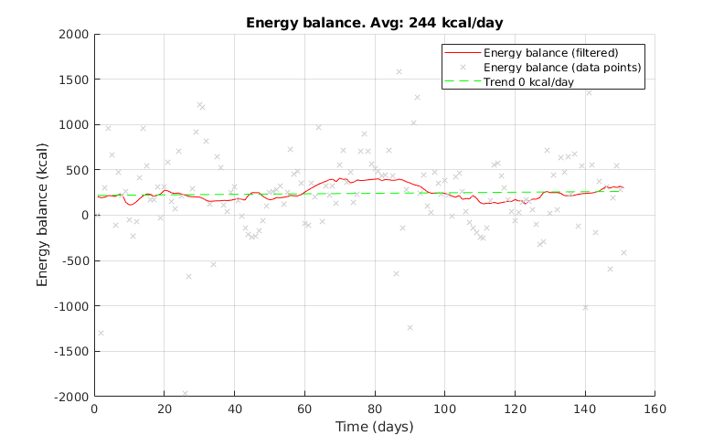

KalorieKalman
=============

KalorieKalman is a script package designed to empower individuals on their
fitness journey by providing estimations of total daily energy
expenditure (TDEE), tracking weight variations, and monitoring daily calorie
deficits. Utilizing the robustness of a Kalman filter, KalorieKalman offers an
innovative approach to health and fitness tracking, making it easier for users
to achieve their dietary goals.

© 2024 Jan Zwiener

Features
--------

* TDEE Estimation: Utilize advanced algorithms to accurately estimate your daily energy expenditure, taking into account various factors for improved accuracy.
* Weight Tracking: Monitor your weight changes over time, providing insights into your progress and helping you stay on track.
* Calorie Deficit Calculation: Automatically calculate your daily calorie deficit, enabling you to understand the effectiveness of your diet and exercise plans.
* Kalman Filter Precision: Incorporate the Kalman filter for enhanced accuracy in predictions and tracking, ensuring you have reliable data to base your decisions on.

Example Results Cut
-------------------

The following figure shows the estimated TDEE (in kcal) over time in red with
the body mass (in kg) curve in blue.  Over the course of 130 days the TDEE is
changing from about 2700 kcal down to about 2600 kcal, probably due to
metabolic adaptions during the diet program.

The filtered body mass trend is shown in this figure, on average the body mass changes by -0.06 kg per day:

The estimated average daily energy balance is -420 kcal/day with a trend in reduction
over time due to metabolic adaptions and lack of discipline in maintaining the
caloric deficit:

Example Results Bulk
--------------------

The following figure shows the estimated TDEE (in kcal) over time in red with
the body mass (in kg) curve in blue. Note how the TDEE goes up to almost 2800
kcal, compared to the cutting phase with approx. 2600 kcal.

The filtered body mass trend is shown in this figure, on average the body mass changes by +30 g per day:

The estimated average daily energy balance is a steady surplus of 244 kcal/day:

Getting Started
---------------

Before you begin, ensure you have the following software installed:

* MATLAB 2017 or higher

Installation
------------

Clone the repository to your local machine:

    git clone https://github.com/yourusername/KalorieKalman.git

Navigate to the cloned repository in MATLAB:

    cd KalorieKalman/matlab

Collect data from iPhone / Apple Health
---------------------------------------

Install the app from the Apple App Store:

    https://apps.apple.com/us/app/simple-health-export-csv/id1535380115

Export the following data types as `.csv` files:

    Body -> BodyMass

    Nutrition -> DietaryEnergyConsumed

Note: this requires tracking your consumed calories (for example with
MyFitnessPal) and body mass (for example with a Bluetooth enabled scale).

Download the data from the CSV app and extract the resulting `.zip` file.
Place the `.csv` files in the `matlab` folder and run in MATLAB the `estimateTDEE.m` script.

Contributing
------------

Contributions to KalorieKalman are welcome! If you have suggestions for
improvements or bug fixes, please feel free to fork the repository and submit a
pull request.
